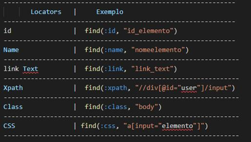
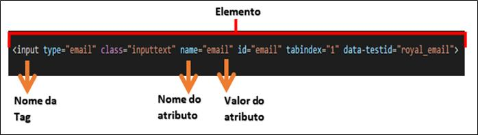
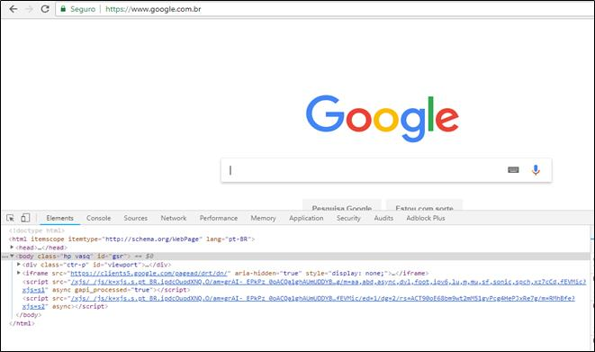
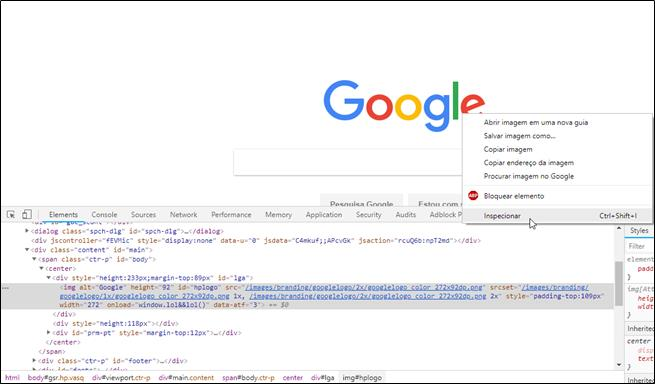
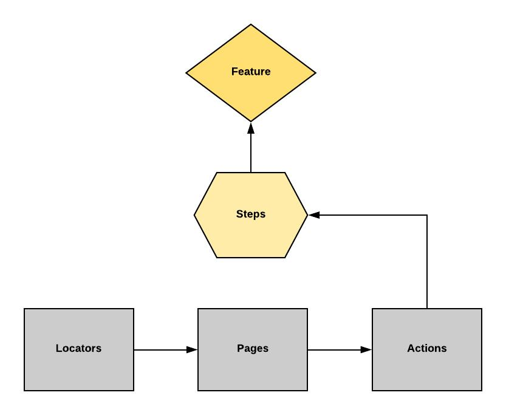
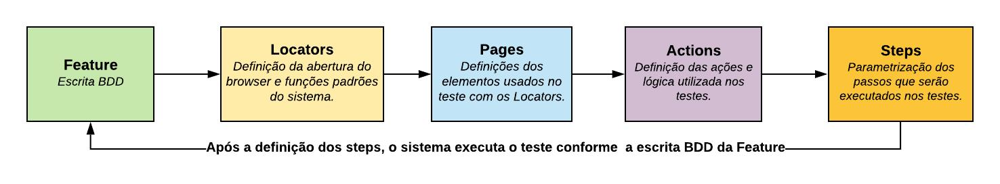

# Sistema de automação de testes

## Sumário:
fazer sumuario aqui

## Objetivo:
O objetivo do sistema é emular a arquitetura de automação do framework de um cliente específico , tornando assim possível a automação de qualquer página web.

## Benefícios da automação de testes:
* Redução da mão de obra; 
* Redução de custos;
* Redução da possibilidade de erros;
* Maior velocidade nos testes;
* Utilização da automação nos testes de regressão;

## Como funciona a automação de testes:
Automação de testes é o uso de software para controlar a execução de testes de software através da aplicação de estratégias e ferramentas, comparando os resultados esperados com os resultados reais. Seus objetivos são a redução do envolvimento humano em atividades manuais, de tempo demandado e de custo final.

Os principais skills para automação são:
* Conhecimento em mapeamento deelementos;
* Conhecimento na ferramenta de testes a ser utilizada;
* Conhecimento na linguagem a ser desenvolvida nos testes;
* Entendimento na estrutura do projeto.

## Mapeando elementos:
Quando iniciamos nossa vida em testes automatizados, a primeira coisa queprecisamos aprender é buscar elementos corretamente. Inspecionando as páginas web, devemos localizar um elemento e enviar um comando para que ele execute uma ação, seja em qualquer linguagem.

Abaixo apresentamos formas de mapeamento dos elementos da página web:

    

## Conhecendo a estrutura de um Elemento:
Primeiro temos que saber o que é um elemento antes de capturá-lo, já sabemos que existem várias possibilidades de busca, seja ela por um valor, um conteúdo, uma tag, um atributo, todo esse conjunto forma um elemento, e dentro desse elemento que podemos realizar nossa busca para interagir.

O que forma esse elemento é uma estrutura ou bloco de códigos, mas individual para cada elemento dentro da tela, para que possamos interagir com eles e fazer o mapeamento correto

Exemplo:
    

    

    
## Como identificar o Elemento:
Quando estamos utilizando uma página web, por exemplo, temos a opção de apertar a tecla F12 do teclado, abrindo assim a página do desenvolvedor, nela a aba de inspeção de elementos, ou clicando com o botão direito do mouse em cima da opção que queremos mapear e clicar em inspecionar.

Utilizando o F12 do teclado, em qualquer navegador.

    

    

## Quando automatizar os testes:
Os testes podem ser automatizados em qualquer momento do desenvolvimento ou alteração do software. O ideal é que eles comecem desde as primeiras linhas de programação —ou até mesmo antes, por meio da chamada técnica TDD (Test-driven development). Além disso, durante o projeto, você pode rodar uma bateria de testes semanais ou diários, de forma a identificar possíveis falhas ao longo do processo.

## Quais testes podem ser automatizados:
São dois os principais tipos de testes que podem ser automatizados: o teste unitário e o teste funcional. O primeiro se refere a testes de ponto a ponto, ou seja, quando eles são feitos em cada um dos fragmentos do código. Já o segundo é um tipo de teste que simula a interação com o usuário, garantindo que o conjunto de funcionalidades esteja correto.

## Os principais desafios da automatização de testes:
O principal desafio relacionado ao tema em questão é a programação do próprio teste. Se a equipe de TI deixa para realizar o teste apenas quando o produto já está pronto, pode ser que a programação seja tão demorada quanto o desenvolvimento de um novo software.
Dessa forma, é importante ficar atento ao fato de que os testes precisam ser iniciados logo no início do processo. Além disso,devem ser feitos de maneira contínua durante todo o desenvolvimento do produto pelo time de TI.

## A arquitetura do projeto:

    

## Fluxo de criação dos casos de teste:

    

